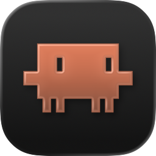

<p align="center">
  
</p>

<h1 align="center">ClaudeControl</h1>

<p align="center">
A native macOS menu bar app for managing multiple Claude Code terminal sessions.
</p>

---

ClaudeControl lives in your menu bar and gives you a central hub for creating, monitoring, and resuming [Claude Code](https://docs.anthropic.com/en/docs/claude-code) sessions. It detects when Claude is waiting for input and notifies you, so you can run multiple sessions in parallel without losing track.

## Features

- **Session Management** — Create new Claude Code sessions from any directory, track all active sessions, and terminate them from one place.
- **Input Detection** — Automatically detects when Claude is waiting for user input using pattern matching on terminal output (prompts, y/n questions, permission requests).
- **Notifications** — Sends macOS notifications and highlights the menu bar icon (orange tint) when any session needs attention.
- **Session History** — Browse and resume previous sessions by reading Claude's native session storage (`~/.claude/projects/`). Sessions are grouped by project with previews of the first prompt, working directory, and git branch.
- **Embedded Terminal** — Each session runs in a floating panel with a full terminal emulator powered by [SwiftTerm](https://github.com/migueldeicaza/SwiftTerm).

## Requirements

- macOS 15.0+
- Xcode 16.0+
- [Claude Code CLI](https://docs.anthropic.com/en/docs/claude-code) installed

## Building

```bash
# Open in Xcode
open ClaudeControl.xcodeproj

# Or build from the command line
xcodebuild -project ClaudeControl.xcodeproj \
  -scheme ClaudeControl \
  -configuration Release \
  build
```

Dependencies (SwiftTerm, Swift Argument Parser) are resolved automatically via Swift Package Manager.

## How It Works

ClaudeControl is a menu bar-only app (no dock icon). Click the menu bar icon to open a popover showing your active sessions. From there you can:

1. **Start a new session** — Pick a working directory and a Claude Code session launches in a floating terminal panel.
2. **Monitor sessions** — Each session row shows its name, directory, and status. A pulsing indicator and "Input needed" badge appear when Claude is waiting.
3. **Resume previous sessions** — Switch to the history tab to browse past sessions and resume them with `claude --resume`.

The app locates the `claude` CLI automatically by checking your shell environment and common install paths (`~/.local/bin/claude`, `/usr/local/bin/claude`, `/opt/homebrew/bin/claude`).

## Project Structure

```
ClaudeControl/
├── App/           # AppDelegate, menu bar icon setup
├── Models/        # Session and PreviousSession data models
├── ViewModels/    # SessionManager, SessionHistoryService
├── Views/         # SwiftUI views (session list, rows, history)
├── Terminal/      # Terminal panel controller, input detection
├── Theme/         # Colors, spacing, animations
└── Assets.xcassets/
```

## License

This project is provided as-is. See the repository for license details.
